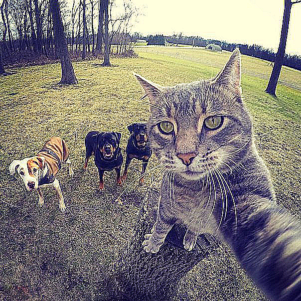

## Результаты

##### Исходное изоражение

### Точечные фильтры

###### 1. Инверсия

###### 2. Черно-белый

###### 3. Сепия

###### 4. Увеличение яркости

###### 5. Эффект волны

###### 6. Эффект волны

###### 6. Эффект волны

###### 7. В бинарное изображение

### Матричные фильтры

###### 1. Размытие Гаусса

###### 2. Размытие Гаусса

###### 3. Линейная коррекция

###### Исходное изоражение

###### Преобразованное изображение

##### 4. Адаптивный фильтр

###### Исходное изоражение

###### Преобразованное изображение

### Выделение границ

##### Исходное изоражение

###### 1. Выделение границ (Собель)

###### 2. Выделение границ (Щарра)

###### 3. Выделение границ (Прюитта)

###### 4. Выделение границ (Робертса)

### Операции матморфологии

##### Исходное изоражение

##### 1. Расширение

##### 2. Сужение

##### 3. Открытие

##### 4. Закрытие

